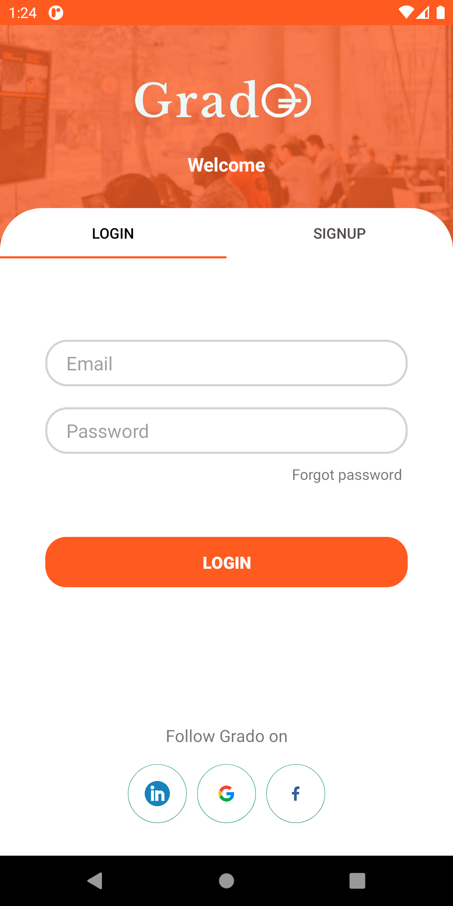
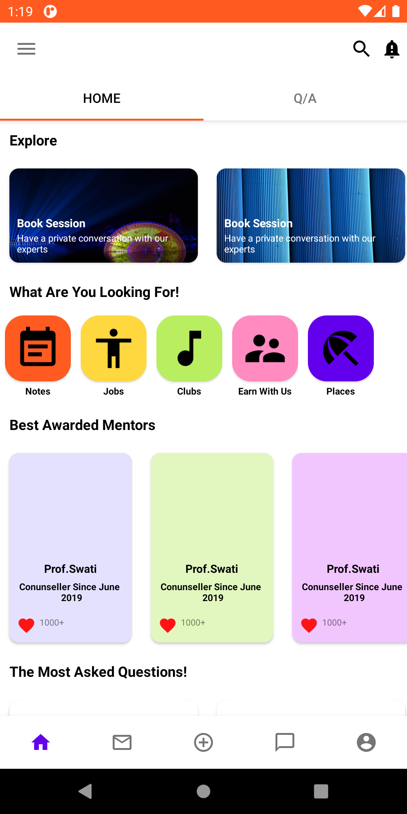
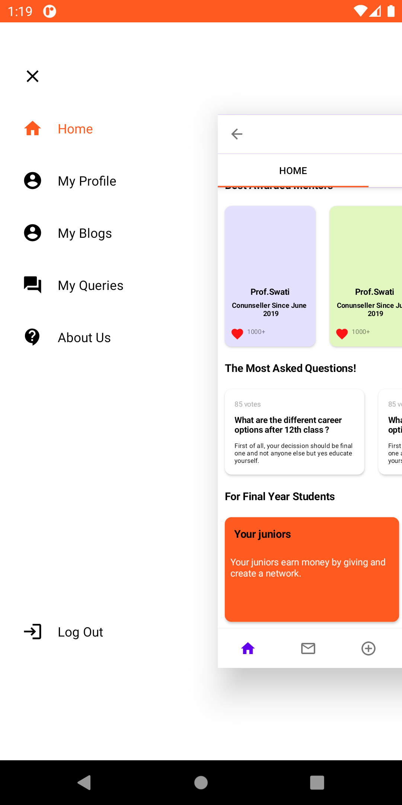

# Grado Edu

Android application for startup that helps students connect to their
peers to help strengthen their skills in various domains. Also, Provides platform to young teachers to market and  stream their courses.

**The app is under development stage and would be going live very soon. 
For more information about our startup visit [grado.in](https://grado.in/)**

## Tech Stack

**Programming languages:** Java,Kotlin

**Android Toolkit:** Android Studio, Android SDK

**Crash/product analytics** Firebase analytics

  
## Screenshots
     
    

## License

MIT License

Copyright (c) 2021 Shashank Vaish

  
